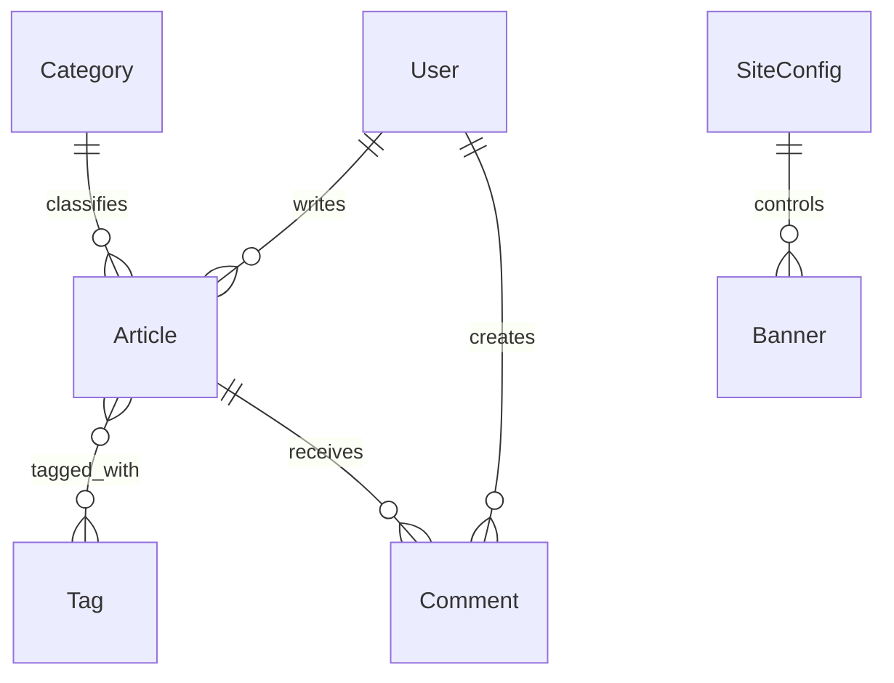

# 数据模型设计文档

## 1. 文档目标

本文档用于补齐博客项目下一阶段的数据模型设计，基于当前实现与 [`next_stage_plan.md`](docs/next_stage_plan.md) 的规划，明确：

- 当前已有模型的职责与字段语义
- 下一阶段建议新增的字段与实体
- 模型之间的关系
- 状态流转与数据约束
- 后续实现时的优先级与注意事项

当前项目已有模型主要位于 [`blog/home/models.py`](blog/home/models.py:1)。

---

## 2. 当前已有模型总览

当前已经存在的核心实体包括：

- [`Tag`](blog/home/models.py:16)
- [`Article`](blog/home/models.py:28)
- [`User`](blog/home/models.py:68)
- [`Category`](blog/home/models.py:78)
- [`SiteConfig`](blog/home/models.py:92)
- `post_tags` 文章与标签中间表 [`post_tags`](blog/home/models.py:6)

这些模型已经足以支持博客 MVP，但对于内容管理、运营配置、评论、权限与 SEO 来说仍然不完整。

---

## 3. 模型关系图

说明：

- 一个用户可以有多篇文章
- 一个分类可以对应多篇文章
- 一篇文章可以有多个标签，一个标签也可以属于多篇文章
- 一篇文章可以拥有多条评论
- Banner 与 SiteConfig 不一定需要外键绑定，但在站点配置语义上属于同一运营域

---

## 4. Article 模型设计

当前模型定义位于 [`Article`](blog/home/models.py:28)。

### 4.1 当前字段说明

| 字段 | 类型 | 当前作用 | 数据来源 |
| --- | --- | --- | --- |
| `id` | Integer | 主键 | 系统生成 |
| `title` | String(100) | 文章标题 | 用户输入 |
| `slug` | String(220) | URL 标识 | 系统生成 / 用户修正 |
| `summary` | Text | 摘要 | 用户输入 |
| `content` | Text | 正文 | 用户输入 |
| `cover_image` | String(500) | 封面图路径 | 用户输入 |
| `is_published` | Boolean | 是否发布 | 用户输入 / 系统控制 |
| `is_featured` | Boolean | 是否推荐 | 用户输入 / 运营控制 |
| `view_count` | Integer | 阅读数 | 系统维护 |
| `author_id` | Integer | 作者 ID | 系统设置 |
| `category_id` | Integer | 分类 ID | 用户选择 |
| `created_at` | DateTime | 创建时间 | 系统生成 |
| `updated_at` | DateTime | 更新时间 | 系统生成 |

### 4.2 当前关系字段

- [`author`](blog/home/models.py:58)：文章作者
- [`category`](blog/home/models.py:59)：文章分类
- [`tags`](blog/home/models.py:60)：文章标签集合

### 4.3 当前设计存在的问题

当前 `Article` 模型已经能支撑展示与创建，但仍存在以下不足：

- 只有 `is_published`，没有明确的发布时间
- 没有草稿、归档、删除等完整状态语义
- 没有 SEO 字段
- 没有评论开关字段
- 没有软删除机制
- 没有文章排序权重字段

### 4.4 建议新增字段

| 字段 | 类型 | 用途 | 是否建议立即实现 |
| --- | --- | --- | --- |
| `status` | String(20) | 统一文章状态，如 `draft` / `published` / `archived` | 是 |
| `published_at` | DateTime | 实际发布时间 | 是 |
| `deleted_at` | DateTime | 软删除时间 | 否 |
| `allow_comment` | Boolean | 是否允许评论 | 是 |
| `seo_title` | String(200) | 页面 SEO 标题 | 否 |
| `seo_description` | String(255) | 页面 SEO 描述 | 否 |
| `sort_order` | Integer | 人工排序权重 | 否 |

### 4.5 推荐状态设计

建议逐步从 `is_published` 迁移到 `status`。

推荐状态值：

- `draft`：草稿
- `published`：已发布
- `archived`：已归档
- `deleted`：逻辑删除

在迁移完成前可以保留：

- `is_published` 作为兼容字段
- `status` 作为新语义来源

### 4.6 文章数据约束建议

- `title` 必填，长度建议不超过 100
- `slug` 唯一
- `summary` 必填
- `content` 必填
- `cover_image` 默认允许为空字符串
- `author_id` 必须存在
- `category_id` 必须存在
- `view_count` 不允许负数

---

## 5. Tag 模型设计

当前模型定义位于 [`Tag`](blog/home/models.py:16)。

### 5.1 当前字段

| 字段 | 类型 | 作用 |
| --- | --- | --- |
| `id` | Integer | 主键 |
| `name` | String(80) | 标签名 |
| `slug` | String(120) | 标签 URL 标识 |
| `created_at` | DateTime | 创建时间 |
| `updated_at` | DateTime | 更新时间 |

### 5.2 当前问题

- 缺少标签描述字段
- 缺少标签展示颜色或视觉标记
- 缺少排序字段

### 5.3 建议新增字段

- `description`
- `sort_order`
- `color`
- `is_active`

---

## 6. Category 模型设计

当前模型定义位于 [`Category`](blog/home/models.py:78)。

### 6.1 当前字段

| 字段 | 类型 | 作用 |
| --- | --- | --- |
| `id` | Integer | 主键 |
| `name` | String(80) | 分类名称 |
| `slug` | String(120) | 分类标识 |
| `description` | Text | 分类说明 |
| `created_at` | DateTime | 创建时间 |
| `updated_at` | DateTime | 更新时间 |

### 6.2 下一步建议

- 维持现有结构即可支撑第一阶段
- 后续如果分类需要在首页展示更多运营信息，可补：
  - `cover_image`
  - `sort_order`
  - `is_active`

---

## 7. User 模型设计

当前模型定义位于 [`User`](blog/home/models.py:68)。

### 7.1 当前字段

| 字段 | 类型 | 作用 |
| --- | --- | --- |
| `id` | Integer | 主键 |
| `username` | String(80) | 用户名 |
| `display_name` | String(120) | 展示名称 |
| `email` | String(120) | 邮箱 |
| `bio` | Text | 个人简介 |
| `created_at` | DateTime | 创建时间 |
| `updated_at` | DateTime | 更新时间 |

### 7.2 当前不足

- 缺少认证字段
- 缺少权限角色字段
- 缺少启用状态
- 缺少头像
- 缺少最近登录时间

### 7.3 建议新增字段

| 字段 | 类型 | 用途 |
| --- | --- | --- |
| `password_hash` | String(255) | 登录密码摘要 |
| `role` | String(20) | `visitor` / `author` / `admin` |
| `avatar` | String(500) | 用户头像 |
| `is_active` | Boolean | 是否启用 |
| `last_login_at` | DateTime | 最近登录时间 |

---

## 8. SiteConfig 模型设计

当前模型定义位于 [`SiteConfig`](blog/home/models.py:92)。

### 8.1 当前字段

| 字段 | 类型 | 作用 |
| --- | --- | --- |
| `site_name` | String(120) | 站点名称 |
| `site_subtitle` | String(200) | 副标题 |
| `site_description` | Text | 站点说明 |
| `header_text` | String(20) | 导航标题文本 |
| `footer_text` | String(200) | 页脚文本 |
| `hero_title` | String(200) | 首页主标题 |
| `hero_subtitle` | Text | 首页副标题 |
| `about_text` | Text | 关于文案 |

### 8.2 当前不足

- 缺少 SEO 配置
- 缺少联系信息
- 缺少 logo / favicon 字段
- 缺少外部社交链接字段

### 8.3 建议新增字段

- `seo_title`
- `seo_keywords`
- `seo_description`
- `site_logo`
- `favicon`
- `contact_email`
- `github_url`
- `bilibili_url`
- `x_url`

---

## 9. Banner 模型设计

根据 [`next_stage_plan.md`](docs/next_stage_plan.md) 的规划，建议将当前页面中的 Banner 静态数据正式沉淀为数据库实体。

### 9.1 推荐实体名

建议使用：

- `Banner`

而不是当前的复数命名 `Banners`，以与其它模型命名保持一致。

### 9.2 建议字段

| 字段 | 类型 | 用途 |
| --- | --- | --- |
| `id` | Integer | 主键 |
| `title` | String(120) | 主标题 |
| `subtitle` | String(255) | 副标题 |
| `image` | String(500) | 图片路径 |
| `description` | Text | 补充文案 |
| `link_url` | String(500) | 点击跳转链接 |
| `link_target` | String(20) | 打开方式 |
| `sort_order` | Integer | 排序 |
| `is_active` | Boolean | 是否启用 |
| `start_at` | DateTime | 生效开始时间 |
| `end_at` | DateTime | 生效结束时间 |
| `created_at` | DateTime | 创建时间 |
| `updated_at` | DateTime | 更新时间 |

### 9.3 图片字段规范

- 统一保存相对静态路径或可控 URL
- 不直接保存第三方临时外链
- 推荐路径格式：`images/banners/filename.jpg`

---

## 10. Comment 模型设计

评论模块目前未实现，但属于下一阶段重点。

### 10.1 推荐字段

| 字段 | 类型 | 用途 |
| --- | --- | --- |
| `id` | Integer | 主键 |
| `article_id` | Integer | 所属文章 |
| `user_id` | Integer | 评论用户，可为空 |
| `nickname` | String(80) | 匿名昵称 |
| `email` | String(120) | 联系邮箱 |
| `content` | Text | 评论内容 |
| `status` | String(20) | 审核状态 |
| `parent_id` | Integer | 父评论 ID |
| `ip_address` | String(64) | 提交 IP |
| `created_at` | DateTime | 创建时间 |
| `updated_at` | DateTime | 更新时间 |

### 10.2 推荐状态

- `pending`
- `approved`
- `rejected`
- `deleted`

### 10.3 关系说明

- 一篇文章可以对应多条评论
- 一条评论可以有多条回复
- 匿名评论时 `user_id` 可为空

---

## 11. 模型演进优先级

### 第一优先级

- `Article` 增加 `status`、`published_at`、`allow_comment`
- 新增 `Banner`
- `SiteConfig` 增加 logo / favicon / SEO 字段

### 第二优先级

- 新增 `Comment`
- `User` 增加认证与角色字段
- `Tag` / `Category` 增加排序与启用状态

### 第三优先级

- `Article` 软删除
- 更丰富的 SEO 字段
- 文章排序权重与运营位字段

---

## 12. 实施注意事项

- 尽量采用增量迁移，不直接破坏现有可运行结构
- 新字段能默认值的尽量给默认值，降低迁移风险
- 先文档化字段语义，再落数据库迁移
- 状态字段设计要先统一，再批量扩展接口与页面
- Banner 与评论模块建议先做最小闭环，再补后台复杂能力
